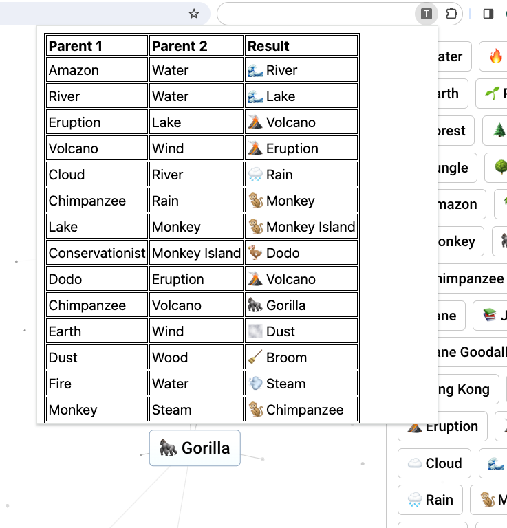

# TIC

---

Tooling for Infinite Craft.

This is a simple PoC Chrome Extension that logs your crafted items and their recipes in Infinite Craft. It currently uses Manifest v2. Manifest v2 will be disabled in Chrome in June 2024 and can currently only be [installed manually as an unpacked extension](https://developer.chrome.com/docs/extensions/get-started/tutorial/hello-world#load-unpacked). This has not yet been tested on Firefox, but might work with minimal adjustments. As far as I know, Firefox does not currently plan to remove support for Manifest v2.

---

###### Next steps:

- [ ] port to Manifest v3
- [ ] prettify popup
  - [ ] add search
  - [ ] show emojis
  - [ ] add links between items
- [ ] don't save dublicates
- [ ] add export / import of items

  - [ ] json
  - [ ] (csv)

- [ ] (port to Firefox)
